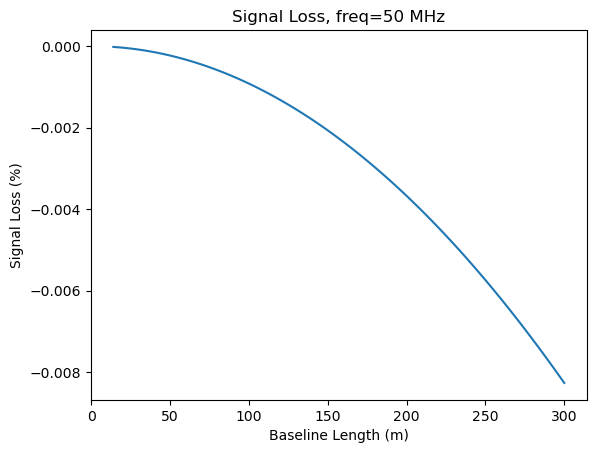
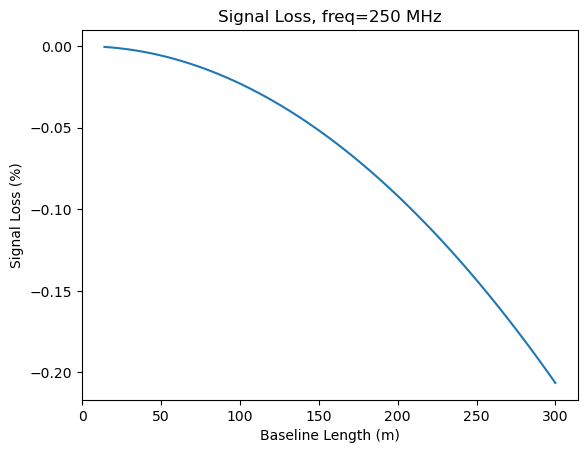

I was recently wondering what the effect of snapshot integration is on the power spectrum. 
I think I have a good handle on it now, but I wanted to write it down for posterity.

The TLDR here is that if you integrate your radio interferometer for some amount of time,
the sky rotates overhead, which decoheres the Fourier modes. My original shocking realization
was that the 10sec of integration that HERA has corresponds to about 6.5 Mpc at $z=8$,
which is similar to a bubble size... so I was worried. But it turns out everything is OK.
Read on...

Let the sky temperature be $T(x,y,z)$ where $(x,y)$ are comoving coordinates in the sky plane and $z$ is comoving in the LOS.

The fourier transform $\tilde{T}$ is

$$
    \tilde{T}(\vec{k}) = \int T(x,y,z) e^{-i 2\pi \vec{k}\cdot\vec{x}} d \vec{x}.
$$

And the power is 

$$
    P(\vec{k}) = \frac{\tilde{T}\tilde{T}^*}{V}
$$

Now, let's assume that the sky is rotating in the $x$ direction such that in a single snapshot, it moves by a total $\Delta x$. Within this time, we are averaging visibilities. In reality, this will be a discrete sum (I think), but let's write it as continuous:

$$
    \tilde{T}'(\vec{k}) = \int_0^{\Delta x} dx' \int T(x-x',y,z) e^{-i 2\pi \vec{k}\cdot\vec{x}} d \vec{x}.
$$

From here, let's use the Fourier Shift Theorem:

\begin{align}
    \tilde{T}'(\vec{k}) &= \frac{1}{\Delta x}\int_0^{\Delta x} dx' e^{-i 2\pi k_x x'} \int T(x,y,z) e^{-i 2\pi \vec{k}\cdot\vec{x}} d \vec{x} \\
    &= \tilde{T}(\vec{k}) \frac{1}{\Delta x} \int_0^{\Delta x} dx' e^{-i 2\pi k_x x'} \\
    &= \frac{i}{\Delta x 2\pi k_x} (e^{-i2\pi k_x \Delta x} - 1) \tilde{T}(\vec{k}).
\end{align}

Taking the power, we get then

$$
   P'(\vec{k}) = \frac{1 - \cos(2\pi \Delta x k_x)}{2\pi^2 (\Delta x)^2 k_x^2} P(\vec{k})
$$

This is $P(\vec{k})$ when $\Delta x \rightarrow 0$, but is zero at $\Delta x = 1/k_x$.

Now, for HERA, which has an integration time of 10 seconds, and a declination of $30^\degree$, $\Delta x$ is:

$$
    \Delta x \approx 2\pi \cos(30) \frac{10}{86400} D_c(z)
$$

which is $\Delta x = 0.59$ Mpc/$h$ at $\nu=250$ MHz and $\Delta x = 0.87$ Mpc/$h$ at $\nu=50$ MHz

On the other hand, $k_x$ is given by the baseline lengths:

$$
    k_x = \frac{b}{\lambda} \frac{2\pi}{D_c(z)}
$$

So, $\Delta x k_x$ is given by

$$
    \Delta x k_x \approx \cos(30) \frac{10}{86400} \frac{b}{\lambda}
$$

```python
def pdim(xk):
    return (1 - np.cos(2*np.pi*xk))/(2*np.pi**2 * xk**2)
```

```python
xk = np.linspace(0, 1, 100)
```

```python
def plot_signal_loss(nu):
    b = np.linspace(14, 300, 100)
    u = b / (300 / nu)
    xk = np.cos(np.pi/6) * 10/86400 * u
    
    plt.plot(b, 100*(pdim(xk) - 1))
    plt.xlabel("Baseline Length (m)")
    plt.ylabel("Signal Loss (%)")
    plt.title(f"Signal Loss, freq={nu} MHz")
```

```python
plot_signal_loss(nu = 50)
```

    

    

```python
plot_signal_loss(250)
```

    

    

